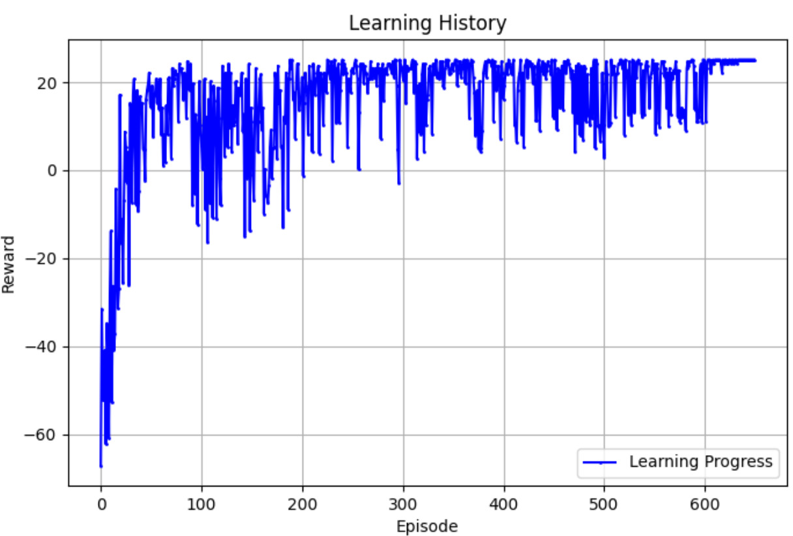

# Assignment: Environment Setup and DQN Agent Implementation

## Environment Setup

The agent is equipped with a 2D LiDAR sensor to detect and track dynamic obstacles within a 5x5 area.

### State
- **S** = [observation (8 beams), distance to goal]

### Actions
- **A** = [up, down, left, right, right-up, right-down, left-up, left-down]

### Environment
- 2D grid with static and dynamic obstacles.

### Rewards
- **Reached goal:** +10  
- **Collision:** -1  
- **If distance to goal decreases:** +0.1  
- **If distance to goal increases:** -0.1  

Example of observation for given state 
Self.lidar_state = [2, 2, 0, 0, 1, 0, 0, 1, 17.1]

---

## Neural Network Architecture (DQN)

The architecture of the Deep Q-Network (DQN) maps input states to Q-values for different actions.

### Network Structure
- **Input layer:** Takes a state vector as input.
- **Hidden layer 1:** Fully connected layer with 128 units and ReLU activation.
- **Hidden layer 2:** Fully connected layer with 128 units and ReLU activation.
- **Output layer:** Fully connected layer that outputs Q-values corresponding to each possible action.

### Learning Parameters
- **GAMMA:** 0.99  
- **Learning Rate (LR):** 0.001  
- **EPSILON (initial):** 1.0  
- **EPSILON_DECAY:** 0.995  
- **EPSILON_MIN:** 0.01  
- **BATCH_SIZE:** 64  
- **MEMORY_SIZE:** 10000  
- **TARGET_UPDATE:** 10  
- **EPOCH:** 650  

---

## Q-Values Calculation

Q-values represent the expected future rewards for each action at a given state. The Q-value for a state-action pair is updated using the Bellman equation:

---

## Results

### **LIDAR + DQN (Static Obstacles)**
- **Environment:** Static obstacles, LiDAR active  
- **Actions:** Horizontal, vertical, diagonal grid steps  

Animation (Static)
  

Plot of Learning History (Static)

**Agent Performance:**  
- Steps: 16  
- Reward: 25.15549442140351  
- Last action: [0, 1]  

---

### **LIDAR + DQN (Dynamic Obstacles)**
- **Environment:** Dynamic obstacles, LiDAR active  
- **Actions:** Horizontal, vertical, diagonal grid steps  

Animation (Dynamic)
  

Plot of Learning History (Dynamic)

**Agent Performance:**  
- Steps: 16  
- Reward: 25.15549442140351  
